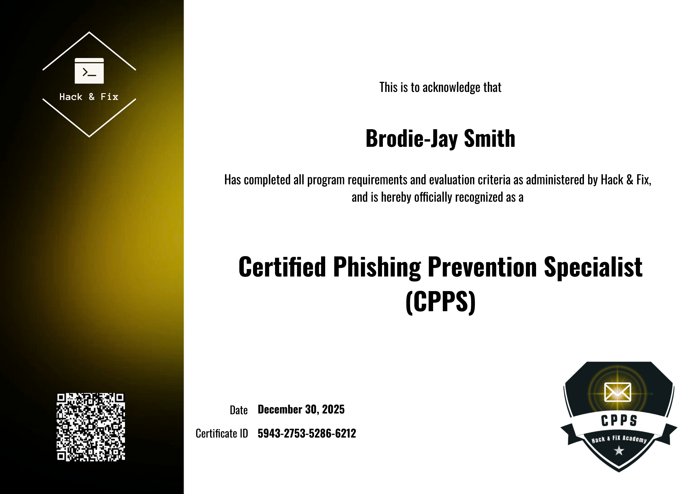

# Certified Phishing Prevention Specialist (CPPS) :shield:

**SOC Lab Achievement**

I'm proud to announce that I have successfully completed the **Certified Phishing Prevention Specialist (CPPS)** certification from Hack & Fix Academy!

This certification has equipped me with practical skills to identify, prevent, and respond to phishing attacks, One of the most common and dangerous threats in cybersecurity today. It's a valuable addition to my Security Operations Center (SOC) skill set, enhancing my capabilities in threat detection, user awareness, and blue team defense.

*Official CPPS Certificate – Issued to Brodie-Jay Smith on December 30, 2025*

## Key Topics Covered

- Phishing fundamentals, psychology, and attack mechanics
- Identification of email phishing, smishing (SMS), vishing (voice), and social media attacks
- Analysis of real world phishing campaigns and advanced attacker tactics
- Best practices for detecting suspicious indicators in emails, links, attachments, and sender behavior
- Effective incident reporting and response procedures
- Multi-layered prevention strategies, including technical controls and awareness training

## Value & Deliverables I Bring to an Organization

With this CPPS certification, I can immediately contribute the following to a security team:

- **Enhanced Phishing Detection**  
  Rapid and accurate identification of phishing attempts during email triage and alert investigation, reducing response times and false negatives.

- **Improved Incident Response**  
  Structured reporting of phishing incidents, containment guidance, and post incident recommendations to minimize impact.

- **Employee Awareness Training Support**  
  Development and delivery of targeted phishing awareness sessions, simulations, and educational materials to reduce user susceptibility.

- **Policy & Process Recommendations**  
  Actionable suggestions for strengthening anti phishing controls (e.g., email filtering, MFA enforcement, attachment sanitization workflows).

- **Threat Intelligence Contribution**  
  Ability to analyze phishing trends and incorporate insights into SOC playbooks and detection rules.

This certification complements hands on SOC experience and demonstrates commitment to defending against one of the top initial access vectors in modern cyberattacks.

Thank you to **Hack & Fix Academy** for providing high quality, practical training!

---
*Last updated: January 02, 2026*
